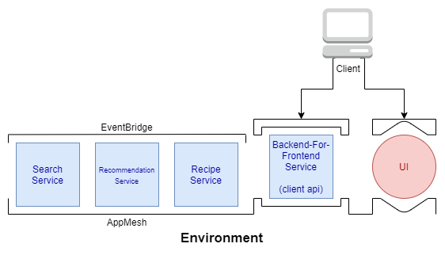

# Microservices Demonstration - OpenRecipe

## About the application
OpenRecipe is a website where people can go to find, share and discover new recipes. 

## The architecture

## Different types of components

There are 3 different types of components

1. Environment

    The environment is the overarching infrastructure that ties all of the microservices together

2. Services

    Services handle discrete areas of the application

    1. Services - Note that the BFF service is publicly accessible too

    2. UI - Front-End

3. UI

    UI is a front-end javascript client