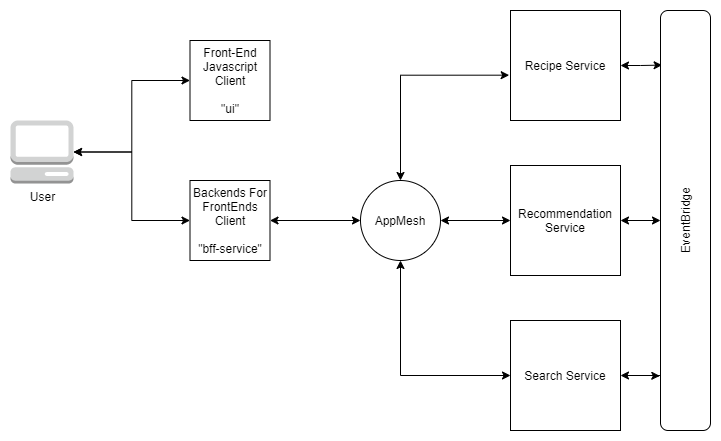

# Services

This folder contains all of the services. In a larger system each of these would probably be its own repository.

    .
    ├── bff-service                   # Backends for Frontends (client API)
    ├── recipe-service                # Handles recipes
    ├── recommendation-service        # Handles Recommendations
    ├── search-service                # Handles Search
    ├── ui                            # The Front-End Javascript client
    └── README.md

## Different types of services

1. Standard Services - these services are completely back-end

    * recipe-service
    * recommendation-service
    * search-service

2. Public-Facing Services - a normal microservice, but the environment has been configured it to be publicly accessible 

    * bff-service

3. UI Service - a javascript front-end

    * ui
